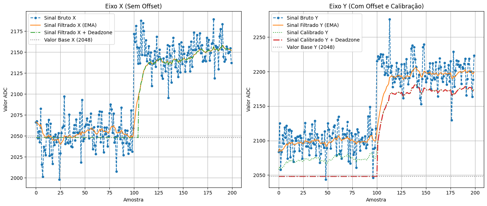

# Controle de Posição Utilizando Joystick

## Vídeo de Demonstração:

[Vídeo no Youtube](https://www.youtube.com/watch?v=yfMyaNfmFMA)

Este projeto implementa um sistema de controle de posição utilizando um joystick na plataforma BitDogLab com Raspberry Pi Pico. O firmware em C realiza as seguintes funcionalidades:

* **Controle de LEDs RGB via PWM:**

  * **LED Vermelho:** Controlado pelo eixo X (intensidade aumenta conforme o joystick se desloca lateralmente).
  * **LED Azul:** Controlado pelo eixo Y (intensidade aumenta conforme o joystick se desloca verticalmente).
  * **LED Verde:** Alterna (liga/desliga) via botão do joystick, servindo de indicador.
* **Exibição em Display OLED SSD1306:**

  Um quadrado móvel representa a posição do joystick e o display exibe informações (valores dos eixos e estado do PWM). A borda do display alterna entre dois estilos a cada pressão do botão do joystick.
* **Filtragem de Sinal com EMA (Média Móvel Exponencial):**

  Suaviza as leituras dos ADCs, reduzindo o ruído e as variações bruscas.
* **Deadzone e Calibração:**

  Pequenas variações em torno do valor central (2048) são ignoradas. O eixo Y é calibrado para corrigir um offset (por exemplo, se o centro medido for 2100, subtrai-se 52 para ajustar para 2048).
* **Interrupções com Debouncing:**

  As leituras dos botões são tratadas via interrupção para evitar múltiplas leituras indesejadas.

---

## Esquema de Conexões e Pinos Utilizados

* **LEDs RGB:**
  * **LED Vermelho:** GPIO 13 (PWM – controlado pelo eixo X)
  * **LED Verde:** GPIO 11 (Digital – alterna via botão do joystick)
  * **LED Azul:** GPIO 12 (PWM – controlado pelo eixo Y)
* **Joystick:**
  * **Eixo X (ADC):** GPIO 27 (ADC1 – utilizado como eixo X)
  * **Eixo Y (ADC):** GPIO 26 (ADC0 – utilizado como eixo Y)
  * **Botão do Joystick:** GPIO 22 (ativo em nível baixo)
* **Botão A:**
  * **Botão A:** GPIO 5 (ativo em nível baixo)
* **Display OLED SSD1306 (I2C):**
  * **SDA:** GPIO 14
  * **SCL:** GPIO 15
  * **Endereço I2C:** 0x3C
* **Constantes Adicionais:**
  * **Deadzone:** 50 unidades (faixa em torno de 2048 onde variações são ignoradas).
  * **Fator EMA (ALPHA):** 0.1 (quanto menor, mais estável, porém mais lenta a resposta).
  * **Offset no Eixo Y (Y_OFFSET):** 52 (caso o centro medido seja 2100, o que deve ser calibrado para 2048).

---

## Clonando o Repositório

Para clonar este repositório, abra um terminal e execute:

```bash
git clone https://github.com/TorRLD/joystick-control.git
```

---

## Compilação e Execução com o Plugin Pi Pico no VSCode

### Pré-requisitos

* [Visual Studio Code](https://code.visualstudio.com/)
* [Plugin Pi Pico para VSCode](https://marketplace.visualstudio.com/items?itemName=ms-vscode.vscode-pico)
* [Raspberry Pi Pico SDK](https://github.com/raspberrypi/pico-sdk)
* Ferramentas de compilação (CMake, Ninja ou Make)

### Passos para Compilar e Executar

1. **Abra o VSCode:**

   Abra o Visual Studio Code e, em seguida, abra a pasta do repositório clonado.
2. **Configuração do Ambiente:**

   Verifique se o ambiente do Raspberry Pi Pico está corretamente configurado. O plugin do Pico normalmente gerencia as variáveis de ambiente e a localização do SDK.
3. **Compilar o Projeto:**

   * Abra a paleta de comandos (Ctrl+Shift+P).
   * Selecione `Pico: Build Project`.
   * O projeto será compilado e o arquivo gerado (por exemplo, um arquivo `.uf2`) aparecerá na pasta de saída.
4. **Upload para o Raspberry Pi Pico:**

   * Conecte o Raspberry Pi Pico pressionando e mantendo o botão BOOTSEL para entrar no modo de armazenamento USB.
   * O dispositivo aparecerá como uma unidade USB.
   * Arraste e solte o arquivo `.uf2` gerado nessa unidade.
5. **Execução:**

   Após o upload, o firmware iniciará automaticamente no Raspberry Pi Pico.

---

## Funcionamento do Projeto

1. **Inicialização:**
   * Configuração dos pinos para LEDs, botões, ADC, PWM e I2C.
   * Inicialização do display OLED SSD1306.
2. **Interrupções:**
   * As leituras dos botões (do joystick e do Botão A) são tratadas via interrupção com debouncing para alternar o LED verde, mudar o estilo da borda e habilitar/desabilitar os LEDs PWM.
3. **Leitura e Filtragem dos Eixos:**
   * Os valores dos eixos X e Y são lidos pelos ADCs.
   * São suavizados utilizando um filtro EMA, que diminui as variações bruscas causadas por ruído.
   * É aplicada uma deadzone, forçando valores próximos a 2048 para 2048.
   * O eixo Y passa por uma calibração, subtraindo um offset (Y_OFFSET) e remapeando a faixa para que o centro seja exatamente 2048.
4. **Controle dos LEDs e Exibição:**
   * Os LEDs PWM (vermelho e azul) ajustam sua intensidade proporcionalmente ao deslocamento do joystick em relação ao centro.
   * O display exibe um quadrado móvel que representa a posição do joystick e informações dos valores lidos e do estado dos LEDs.

---

## Simulação e Visualização (Opcional)

Para auxiliar na compreensão do funcionamento do filtro EMA, deadzone e calibração, foram gerados gráficos comparando o sinal bruto, o sinal filtrado com EMA, e o sinal após a aplicação da deadzone e calibração.

### Gráficos da Aplicação do Filtro, DEADZONE e OFFSET



---

## Contribuições

Contribuições são bem-vindas! Sinta-se à vontade para abrir issues ou enviar pull requests com melhorias, correções ou novas funcionalidades.

---

## Licença

Este projeto está licenciado sob a [MIT License](LICENSE).
